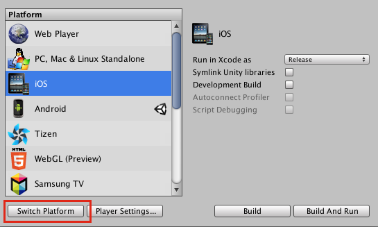
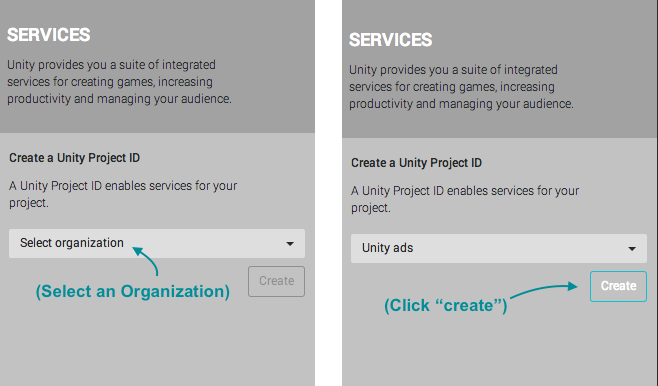
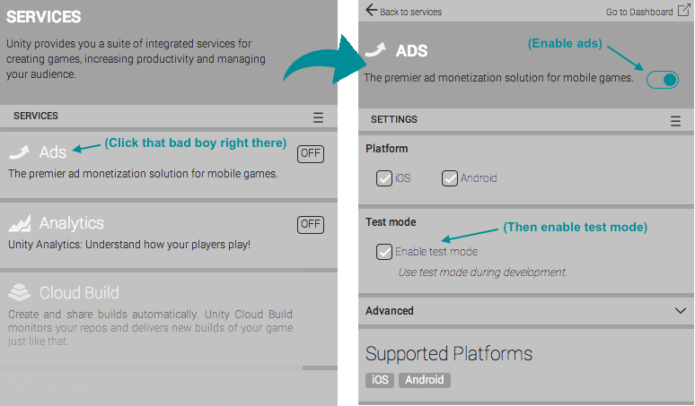

#### Welcome to Unity Ads!

- This repo includes an example project and quickstart guide for **Unity 5.2 or later**. Additional integration guides:
	- [Asset Package]()
	- [Native iOS]()
	- [Native Android]()

INTEGRATING UNITY ADS
===========================

> Updated: February 17th, 2016

### Enable Ads in Unity

- First, open your game project, or create a new Unity project
- Select **Edit > Build Settings** and set the platform to iOS or Android 
- Enable Ads in the Unity Services Panel



- Once that's done, select **Window > Unity Services** 
- Select an Organization from the drop down menu
- Click **Create**



- Click **Ads**, and enable the SDK in your project.



### Add the code

1. First, declare the Unity Ads namespace in the header of your script  
 	`using UnityEngine.Advertisements;`

2. You can display an ad by calling the following method  
	`Advertisement.Show()`

### Example Code
##### Add a button to your scene that plays an ad, then handles status and callbacks

1. Select **Game Object > UI > Button** to add a Button in your scene
2. Add the following script to the button

```csharp
using UnityEngine;
using UnityEngine.UI;
using UnityEngine.Advertisements;
using System.Collections;

[RequireComponent(typeof(Button))]
public class UnityAdsButton : MonoBehaviour
{
	public string zoneId;

	private Button _button;

	void Start ()
	{
		_button = GetComponent&lt;Button&gt;();

		if (_button) _button.onClick.AddListener (delegate() { ShowAdPlacement(); });
	}

	void Update ()
	{
		if (_button) {
			if (string.IsNullOrEmpty (zoneId)) zoneId = null;
			_button.interactable = Advertisement.IsReady (zoneId);
		}
	}

	void ShowAdPlacement ()
	{
		if (string.IsNullOrEmpty (zoneId)) zoneId = null;

		ShowOptions options = new ShowOptions();
		options.resultCallback = HandleShowResult;

		Advertisement.Show (zoneId, options);
	}

	private void HandleShowResult (ShowResult result)
	{
		switch (result)
		{
		case ShowResult.Finished:
			Debug.Log ("Video completed. Offer a reward to the player.");
			break;
		case ShowResult.Skipped:
			Debug.LogWarning ("Video was skipped.");
			break;
		case ShowResult.Failed:
			Debug.LogError ("Video failed to show.");
			break;
		}
	}
}
```


- Additional examples and troubleshooting can be found in our [monetization documentation](http://unityads.unity3d.com/help/monetization/integration-guide-unity).
- For additional questions, check out the [forum](http://forum.unity3d.com/forums/unity-ads.67) or contact support@unity3d.com

### How to reward players

- It's a good idea to reward players for watching ads
- Rewarding players adds user engagement, resulting in higher revenue

- A rewarded ads implementation generally includes one or more of the following: 
	- In-game currency reward
	- Extra lives at the start of the game
	- Point boosts for the next round


- You can reward players for completing a video ad when the result of showing an ad is **ShowResult.Finished**

```csharp
private void HandleShowResult (ShowResult result)
if (result == ShowResult.Finished)
{
//Add code to reward your player here!
//Give coins, etc
}
```


### Manage your profile in the [Dashboard](https://dashboard.unityads.unity3d.com/Dashboard)

- Log into the [Dashboard](https://dashboard.unityads.unity3d.com/Dashboard) using your UDN Account
- From here, you can modify placements and other game-specific settings.


- Additional information on placements can be found in our [placements Documentation](http://unityads.unity3d.com/help/monetization/placements).
- For additional questions, check out the [forum](http://forum.unity3d.com/forums/unity-ads.67) or contact support@unity3d.com

